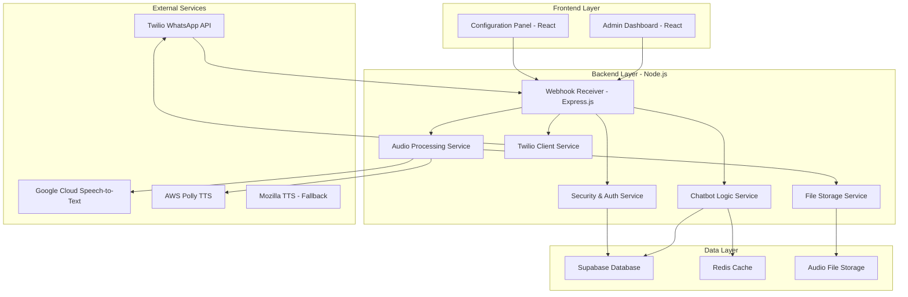
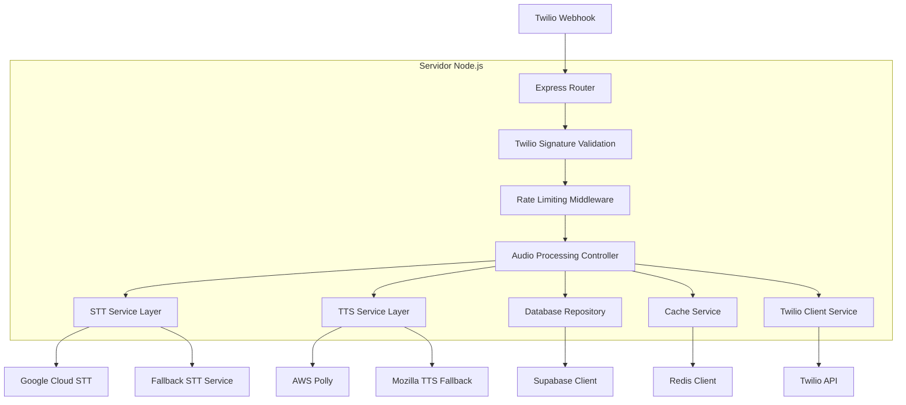
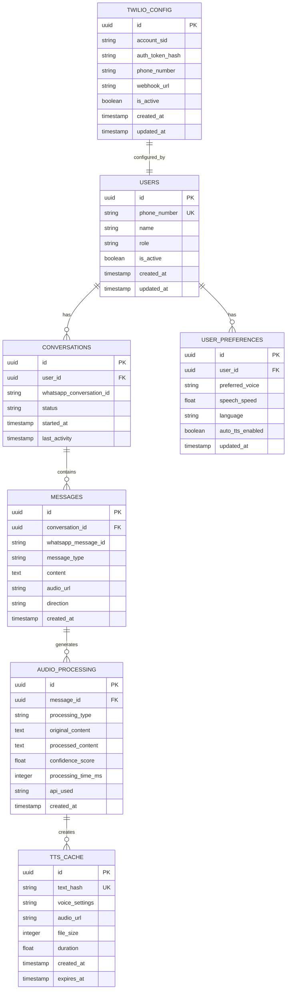

# Documento de Arquitetura Técnica - Chatbot WhatsApp com Acessibilidade

## 1. Design da Arquitetura



## 2. Descrição das Tecnologias

* **Backend**: Node.js\@18 + Express.js\@4 + TypeScript

* **Frontend**: React\@18 + TypeScript + Tailwind CSS\@3 + Vite

* **Database**: Supabase (PostgreSQL)

* **Cache**: Redis\@7

* **Audio Processing**: FFmpeg, node-ffmpeg

* **TTS/STT**: Google Cloud Speech-to-Text, AWS Polly, Mozilla TTS (fallback)

* **WhatsApp Integration**: Twilio WhatsApp API, Twilio SDK\@4, webhooks

* **Security**: bcrypt, jsonwebtoken, helmet, rate-limiting, Twilio signature validation

* **Twilio Dependencies**: twilio\@4, express-validator, multer (para upload de mídia)

## 3. Definições de Rotas

| Rota                   | Propósito                                 |
| ---------------------- | ----------------------------------------- |
| /webhook/twilio        | Receber mensagens do Twilio WhatsApp via webhook |
| /api/audio/process     | Processar arquivos de áudio (STT)         |
| /api/audio/synthesize  | Converter texto para áudio (TTS)          |
| /api/config/tts        | Configurar preferências de TTS            |
| /api/config/stt        | Configurar preferências de STT            |
| /api/config/twilio     | Configurar credenciais e webhooks Twilio |
| /api/dashboard/metrics | Obter métricas de uso do sistema          |
| /api/auth/login        | Autenticação de administradores           |
| /api/users/preferences | Gerenciar preferências de usuário         |
| /admin                 | Painel administrativo React               |
| /config                | Painel de configuração React              |

## 4. Definições de API

### 4.1 APIs Principais

**Webhook do Twilio WhatsApp**

```
POST /webhook/twilio
```

Request:

| Nome do Parâmetro                  | Tipo   | Obrigatório | Descrição                                      |
| ---------------------------------- | ------ | ----------- | ---------------------------------------------- |
| MessageSid                         | string | true        | ID único da mensagem no Twilio                |
| From                               | string | true        | Número do remetente (formato: whatsapp:+5511999999999) |
| To                                 | string | true        | Número do destinatário                         |
| Body                               | string | false       | Conteúdo da mensagem de texto                  |
| MediaUrl0                          | string | false       | URL do arquivo de mídia (áudio, imagem, etc.) |
| MediaContentType0                  | string | false       | Tipo de conteúdo da mídia                      |

Response:

| Nome do Parâmetro | Tipo   | Descrição                 |
| ----------------- | ------ | ------------------------- |
| status            | string | Status do processamento   |
| message\_id       | string | ID da mensagem processada |

**Processamento de Áudio (STT)**

```
POST /api/audio/process
```

Request:

| Nome do Parâmetro | Tipo   | Obrigatório | Descrição                        |
| ----------------- | ------ | ----------- | -------------------------------- |
| audio\_url        | string | true        | URL do arquivo de áudio          |
| language          | string | false       | Código do idioma (padrão: pt-BR) |
| user\_id          | string | true        | ID do usuário                    |

Response:

| Nome do Parâmetro | Tipo   | Descrição                         |
| ----------------- | ------ | --------------------------------- |
| transcription     | string | Texto transcrito do áudio         |
| confidence        | number | Nível de confiança da transcrição |
| processing\_time  | number | Tempo de processamento em ms      |

Exemplo Request Twilio:

```json
{
  "MessageSid": "SM1234567890abcdef",
  "From": "whatsapp:+5511999999999",
  "To": "whatsapp:+5511888888888",
  "Body": "Olá, preciso de ajuda",
  "MediaUrl0": "https://api.twilio.com/2010-04-01/Accounts/AC.../Messages/SM.../Media/ME...",
  "MediaContentType0": "audio/ogg"
}
```

**Síntese de Áudio (TTS)**

```
POST /api/audio/synthesize
```

Request:

| Nome do Parâmetro | Tipo   | Obrigatório | Descrição                     |
| ----------------- | ------ | ----------- | ----------------------------- |
| text              | string | true        | Texto para converter em áudio |
| voice             | string | false       | Voz selecionada               |
| speed             | number | false       | Velocidade da fala (0.5-2.0)  |
| user\_id          | string | true        | ID do usuário                 |

Response:

| Nome do Parâmetro | Tipo   | Descrição                      |
| ----------------- | ------ | ------------------------------ |
| audio\_url        | string | URL do arquivo de áudio gerado |
| duration          | number | Duração do áudio em segundos   |
| file_size        | number | Tamanho do arquivo em bytes    |

**Configuração do Twilio**

```
POST /api/config/twilio
```

Request:

| Nome do Parâmetro | Tipo   | Obrigatório | Descrição                           |
| ----------------- | ------ | ----------- | ----------------------------------- |
| account_sid       | string | true        | Account SID do Twilio               |
| auth_token        | string | true        | Auth Token do Twilio                |
| phone_number      | string | true        | Número WhatsApp Business registrado |
| webhook_url       | string | true        | URL do webhook para receber mensagens |

Response:

| Nome do Parâmetro | Tipo    | Descrição                      |
| ----------------- | ------- | ------------------------------ |
| status            | boolean | Status da configuração         |
| webhook_configured| boolean | Se o webhook foi configurado   |
| phone_verified    | boolean | Se o número foi verificado     |

## 5. Arquitetura do Servidor



## 6. Modelo de Dados

### 6.1 Definição do Modelo de Dados



### 6.2 Linguagem de Definição de Dados (DDL)

**Tabela de Usuários**

```sql
-- Criar tabela de usuários
CREATE TABLE users (
    id UUID PRIMARY KEY DEFAULT gen_random_uuid(),
    phone_number VARCHAR(20) UNIQUE NOT NULL,
    name VARCHAR(100) NOT NULL,
    role VARCHAR(20) DEFAULT 'patient' CHECK (role IN ('patient', 'doctor', 'nurse', 'admin')),
    is_active BOOLEAN DEFAULT true,
    created_at TIMESTAMP WITH TIME ZONE DEFAULT NOW(),
    updated_at TIMESTAMP WITH TIME ZONE DEFAULT NOW()
);

-- Criar índices
CREATE INDEX idx_users_phone ON users(phone_number);
CREATE INDEX idx_users_role ON users(role);
CREATE INDEX idx_users_active ON users(is_active);

-- Políticas de segurança Supabase
GRANT SELECT ON users TO anon;
GRANT ALL PRIVILEGES ON users TO authenticated;
```

**Tabela de Preferências do Usuário**

```sql
-- Criar tabela de preferências
CREATE TABLE user_preferences (
    id UUID PRIMARY KEY DEFAULT gen_random_uuid(),
    user_id UUID REFERENCES users(id) ON DELETE CASCADE,
    preferred_voice VARCHAR(50) DEFAULT 'pt-BR-Wavenet-A',
    speech_speed FLOAT DEFAULT 1.0 CHECK (speech_speed >= 0.5 AND speech_speed <= 2.0),
    language VARCHAR(10) DEFAULT 'pt-BR',
    auto_tts_enabled BOOLEAN DEFAULT true,
    updated_at TIMESTAMP WITH TIME ZONE DEFAULT NOW()
);

-- Criar índices
CREATE INDEX idx_user_preferences_user_id ON user_preferences(user_id);

-- Políticas de segurança
GRANT SELECT ON user_preferences TO anon;
GRANT ALL PRIVILEGES ON user_preferences TO authenticated;
```

**Tabela de Conversas**

```sql
-- Criar tabela de conversas
CREATE TABLE conversations (
    id UUID PRIMARY KEY DEFAULT gen_random_uuid(),
    user_id UUID REFERENCES users(id) ON DELETE CASCADE,
    whatsapp_conversation_id VARCHAR(100) UNIQUE NOT NULL,
    status VARCHAR(20) DEFAULT 'active' CHECK (status IN ('active', 'closed', 'archived')),
    started_at TIMESTAMP WITH TIME ZONE DEFAULT NOW(),
    last_activity TIMESTAMP WITH TIME ZONE DEFAULT NOW()
);

-- Criar índices
CREATE INDEX idx_conversations_user_id ON conversations(user_id);
CREATE INDEX idx_conversations_whatsapp_id ON conversations(whatsapp_conversation_id);
CREATE INDEX idx_conversations_status ON conversations(status);
CREATE INDEX idx_conversations_last_activity ON conversations(last_activity DESC);

-- Políticas de segurança
GRANT SELECT ON conversations TO anon;
GRANT ALL PRIVILEGES ON conversations TO authenticated;
```

**Tabela de Mensagens**

```sql
-- Criar tabela de mensagens
CREATE TABLE messages (
    id UUID PRIMARY KEY DEFAULT gen_random_uuid(),
    conversation_id UUID REFERENCES conversations(id) ON DELETE CASCADE,
    whatsapp_message_id VARCHAR(100) UNIQUE NOT NULL,
    message_type VARCHAR(20) NOT NULL CHECK (message_type IN ('text', 'audio', 'image', 'document')),
    content TEXT,
    audio_url VARCHAR(500),
    direction VARCHAR(10) NOT NULL CHECK (direction IN ('inbound', 'outbound')),
    created_at TIMESTAMP WITH TIME ZONE DEFAULT NOW()
);

-- Criar índices
CREATE INDEX idx_messages_conversation_id ON messages(conversation_id);
CREATE INDEX idx_messages_whatsapp_id ON messages(whatsapp_message_id);
CREATE INDEX idx_messages_type ON messages(message_type);
CREATE INDEX idx_messages_created_at ON messages(created_at DESC);

-- Políticas de segurança
GRANT SELECT ON messages TO anon;
GRANT ALL PRIVILEGES ON messages TO authenticated;
```

**Tabela de Processamento de Áudio**

```sql
-- Criar tabela de processamento de áudio
CREATE TABLE audio_processing (
    id UUID PRIMARY KEY DEFAULT gen_random_uuid(),
    message_id UUID REFERENCES messages(id) ON DELETE CASCADE,
    processing_type VARCHAR(10) NOT NULL CHECK (processing_type IN ('stt', 'tts')),
    original_content TEXT NOT NULL,
    processed_content TEXT NOT NULL,
    confidence_score FLOAT CHECK (confidence_score >= 0 AND confidence_score <= 1),
    processing_time_ms INTEGER NOT NULL,
    api_used VARCHAR(50) NOT NULL,
    created_at TIMESTAMP WITH TIME ZONE DEFAULT NOW()
);

-- Criar índices
CREATE INDEX idx_audio_processing_message_id ON audio_processing(message_id);
CREATE INDEX idx_audio_processing_type ON audio_processing(processing_type);
CREATE INDEX idx_audio_processing_api ON audio_processing(api_used);
CREATE INDEX idx_audio_processing_created_at ON audio_processing(created_at DESC);

-- Políticas de segurança
GRANT SELECT ON audio_processing TO anon;
GRANT ALL PRIVILEGES ON audio_processing TO authenticated;
```

**Tabela de Cache TTS**

```sql
-- Criar tabela de cache TTS
CREATE TABLE tts_cache (
    id UUID PRIMARY KEY DEFAULT gen_random_uuid(),
    text_hash VARCHAR(64) UNIQUE NOT NULL,
    voice_settings JSONB NOT NULL,
    audio_url VARCHAR(500) NOT NULL,
    file_size INTEGER NOT NULL,
    duration FLOAT NOT NULL,
    created_at TIMESTAMP WITH TIME ZONE DEFAULT NOW(),
    expires_at TIMESTAMP WITH TIME ZONE DEFAULT (NOW() + INTERVAL '7 days')
);

-- Criar índices
CREATE INDEX idx_tts_cache_text_hash ON tts_cache(text_hash);
CREATE INDEX idx_tts_cache_expires_at ON tts_cache(expires_at);

-- Políticas de segurança
GRANT SELECT ON tts_cache TO anon;
GRANT ALL PRIVILEGES ON tts_cache TO authenticated;

**Tabela de Configuração Twilio**

```sql
-- Criar tabela de configuração Twilio
CREATE TABLE twilio_config (
    id UUID PRIMARY KEY DEFAULT gen_random_uuid(),
    account_sid VARCHAR(100) UNIQUE NOT NULL,
    auth_token_hash VARCHAR(255) NOT NULL,
    phone_number VARCHAR(20) UNIQUE NOT NULL,
    webhook_url VARCHAR(500) NOT NULL,
    is_active BOOLEAN DEFAULT true,
    created_at TIMESTAMP WITH TIME ZONE DEFAULT NOW(),
    updated_at TIMESTAMP WITH TIME ZONE DEFAULT NOW()
);

-- Criar índices
CREATE INDEX idx_twilio_config_account_sid ON twilio_config(account_sid);
CREATE INDEX idx_twilio_config_phone ON twilio_config(phone_number);
CREATE INDEX idx_twilio_config_active ON twilio_config(is_active);

-- Políticas de segurança
GRANT SELECT ON twilio_config TO authenticated;
GRANT INSERT, UPDATE ON twilio_config TO authenticated;
```

-- Dados iniciais
INSERT INTO users (phone_number, name, role) VALUES 
('+5511999999999', 'Dr. João Silva', 'doctor'),
('+5511888888888', 'Enfermeira Maria', 'nurse'),
('+5511777777777', 'Admin Sistema', 'admin');

INSERT INTO user_preferences (user_id, preferred_voice, speech_speed, auto_tts_enabled)
SELECT id, 'pt-BR-Wavenet-A', 1.0, true FROM users WHERE role IN ('doctor', 'nurse', 'admin');

-- Configuração inicial do Twilio (exemplo)
INSERT INTO twilio_config (account_sid, auth_token_hash, phone_number, webhook_url)
VALUES ('ACxxxxxxxxxxxxxxxxxxxxxxxxxxxxxxxx', '$2b$10$hashedtoken...', '+5511888888888', 'https://yourdomain.com/webhook/twilio');
```

