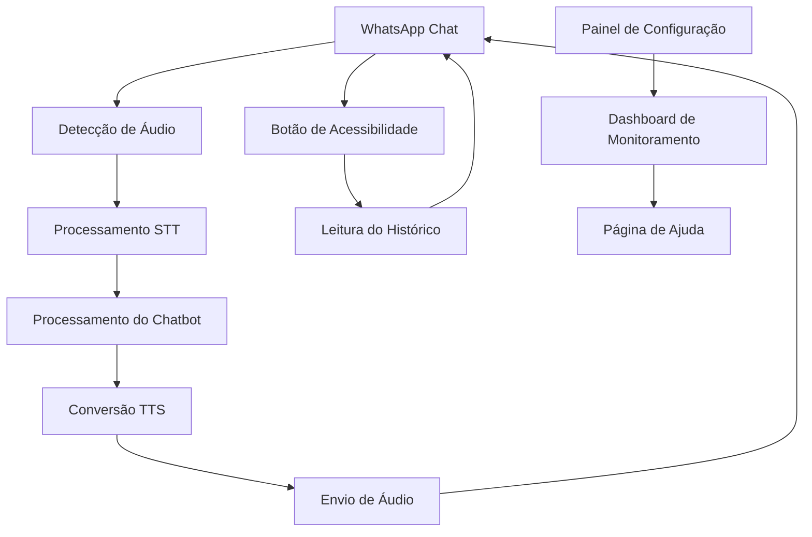

# Documento de Requisitos do Produto - Chatbot WhatsApp com Funcionalidades de Acessibilidade

## 1. Visão Geral do Produto

Sistema de integração de funcionalidades de acessibilidade em chatbot WhatsApp existente para ambiente médico de nefrologia, utilizando Node.js para processamento de áudio, conversão texto-para-fala (TTS) e reconhecimento de fala (STT).

O produto visa tornar a comunicação médica mais acessível para pacientes com deficiências visuais ou auditivas, permitindo interação por voz e áudio em consultas virtuais de nefrologia.

Objetivo: Aumentar a acessibilidade e inclusão digital em serviços de saúde, melhorando a experiência do paciente e a eficiência do atendimento médico.

## 2. Funcionalidades Principais

### 2.1 Papéis de Usuário

| Papel | Método de Registro | Permissões Principais |
|-------|-------------------|----------------------|
| Paciente | Número de telefone verificado | Enviar áudios, receber respostas em áudio, usar botão de acessibilidade |
| Médico/Enfermeiro | Credenciais profissionais + WhatsApp Business | Todas as funcionalidades do paciente + acesso a dados médicos |
| Administrador | Convite do sistema | Configurar APIs, gerenciar usuários, monitorar sistema |

### 2.2 Módulos de Funcionalidade

Nosso sistema de acessibilidade consiste nas seguintes páginas principais:

1. **Interface de Chat WhatsApp**: processamento de mensagens, detecção de áudio, botão de acessibilidade
2. **Painel de Configuração**: configuração de APIs TTS/STT, preferências de voz, configurações de segurança
3. **Dashboard de Monitoramento**: estatísticas de uso, logs de conversão, métricas de performance
4. **Página de Ajuda**: tutorial de uso, comandos de voz, troubleshooting

### 2.3 Detalhes das Páginas

| Nome da Página | Nome do Módulo | Descrição da Funcionalidade |
|----------------|----------------|-----------------------------|
| Interface de Chat WhatsApp | Processamento de Áudio | Detectar mensagens de áudio recebidas, extrair e processar arquivo de áudio, converter áudio para texto usando STT |
| Interface de Chat WhatsApp | Resposta em Áudio | Converter texto de resposta para áudio usando TTS, enviar áudio de volta para o usuário, suportar múltiplas vozes e idiomas |
| Interface de Chat WhatsApp | Botão de Acessibilidade | Adicionar botão inline no chat, ler histórico da conversa em voz alta, controles de reprodução (pausar, acelerar, repetir) |
| Painel de Configuração | Configuração de APIs | Configurar credenciais Google Cloud Speech-to-Text, configurar AWS Polly, definir fallbacks para APIs gratuitas |
| Painel de Configuração | Preferências de Voz | Selecionar vozes disponíveis, ajustar velocidade e tom, configurar idioma padrão |
| Dashboard de Monitoramento | Métricas de Uso | Exibir estatísticas de conversões TTS/STT, monitorar tempo de resposta, rastrear custos de API |
| Dashboard de Monitoramento | Logs de Sistema | Registrar erros de conversão, logs de segurança, auditoria de acesso a dados médicos |
| Página de Ajuda | Tutorial Interativo | Guia passo-a-passo para usar funcionalidades de áudio, exemplos de comandos de voz, FAQ sobre acessibilidade |

## 3. Processo Principal

**Fluxo do Paciente:**
1. Paciente envia mensagem de áudio via WhatsApp
2. Sistema detecta áudio e processa via STT
3. Chatbot processa texto e gera resposta
4. Sistema converte resposta para áudio via TTS
5. Áudio é enviado de volta ao paciente
6. Paciente pode usar botão de acessibilidade para ouvir histórico

**Fluxo do Profissional de Saúde:**
1. Médico acessa painel de configuração
2. Define preferências de voz e APIs
3. Monitora interações via dashboard
4. Revisa logs de segurança e auditoria
5. Ajusta configurações conforme necessário

## 4. Design da Interface do Usuário

### 4.1 Estilo de Design

- **Cores Primárias**: Azul médico (#2E86AB), Verde acessibilidade (#A23B72)
- **Cores Secundárias**: Cinza claro (#F8F9FA), Branco (#FFFFFF)
- **Estilo de Botões**: Arredondados com bordas suaves, alto contraste para acessibilidade
- **Fonte**: Inter ou Roboto, tamanhos 14px-18px para legibilidade
- **Layout**: Design responsivo, foco em acessibilidade com navegação por teclado
- **Ícones**: Material Design Icons, com ênfase em ícones de áudio e acessibilidade 🔊 🎤 ♿

### 4.2 Visão Geral do Design das Páginas

| Nome da Página | Nome do Módulo | Elementos de UI |
|----------------|----------------|----------------|
| Interface de Chat WhatsApp | Botão de Acessibilidade | Botão flutuante azul com ícone de alto-falante, posicionado no canto inferior direito, animação de pulso durante reprodução |
| Interface de Chat WhatsApp | Indicadores de Áudio | Ícones de microfone e alto-falante nas mensagens, barra de progresso para áudios, indicador visual de processamento |
| Painel de Configuração | Formulários de API | Cards brancos com bordas azuis, campos de input com labels claros, botões de teste de conectividade |
| Dashboard de Monitoramento | Gráficos e Métricas | Gráficos de linha para uso ao longo do tempo, cards coloridos para KPIs, tabelas responsivas para logs |
| Página de Ajuda | Tutorial Interativo | Layout em steps com navegação clara, vídeos incorporados, seção de FAQ expansível |

### 4.3 Responsividade

O sistema é mobile-first com adaptação para desktop, otimizado para interação touch no WhatsApp Web e aplicativo móvel. Inclui suporte a gestos de acessibilidade e navegação por voz para usuários com deficiências motoras.